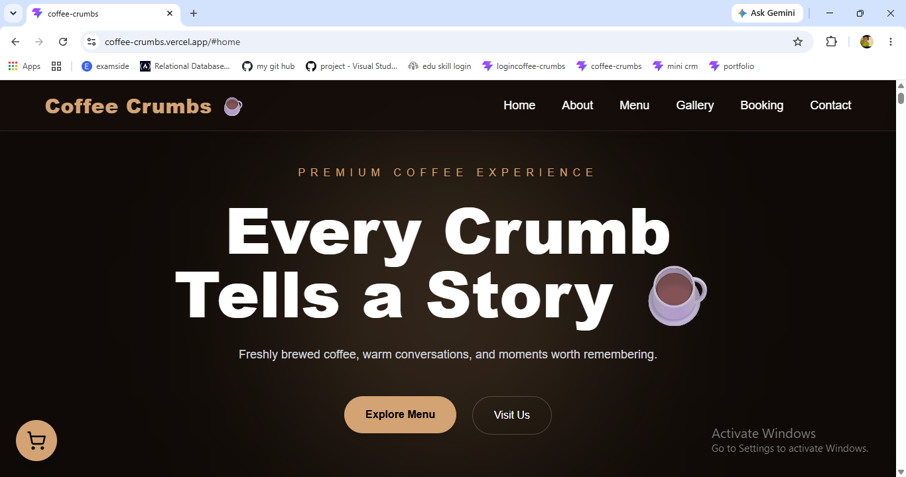
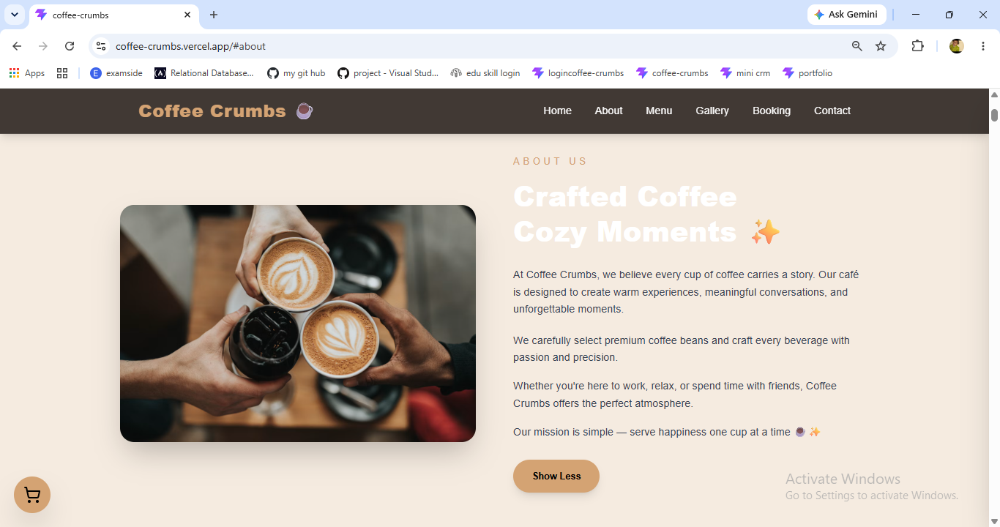
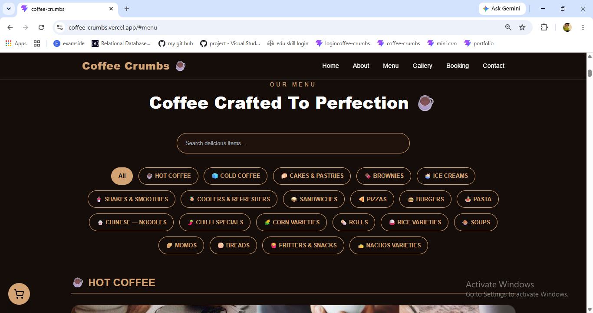
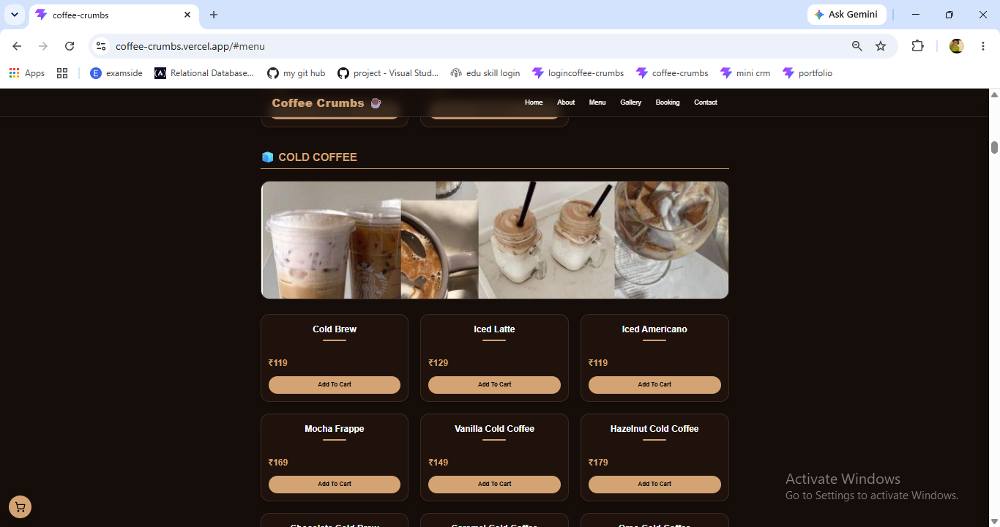
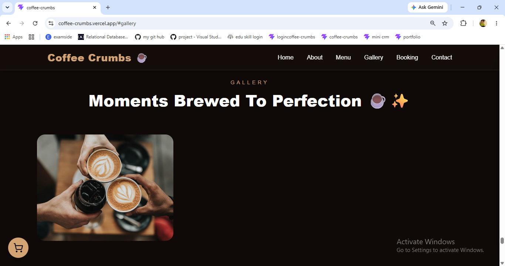
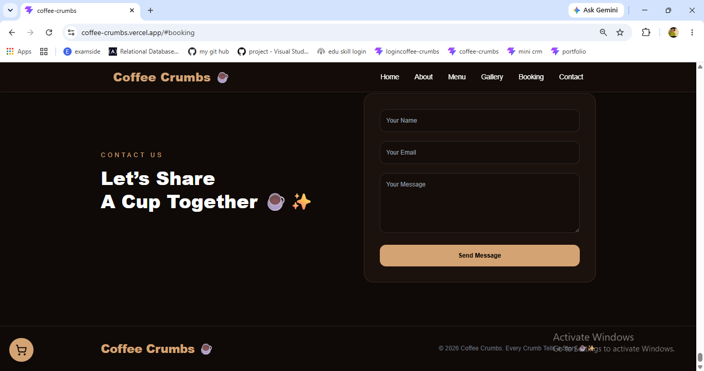
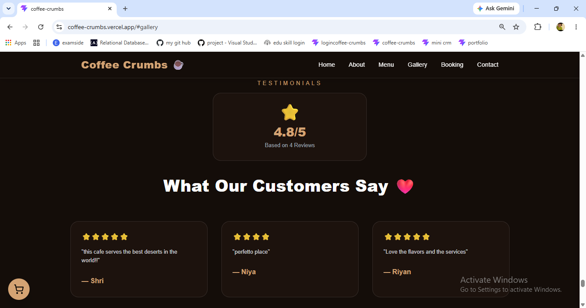
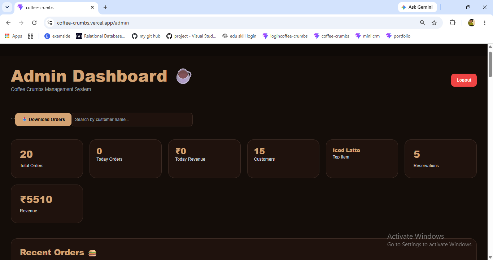
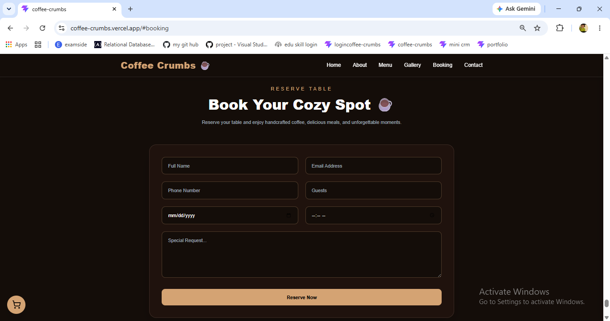
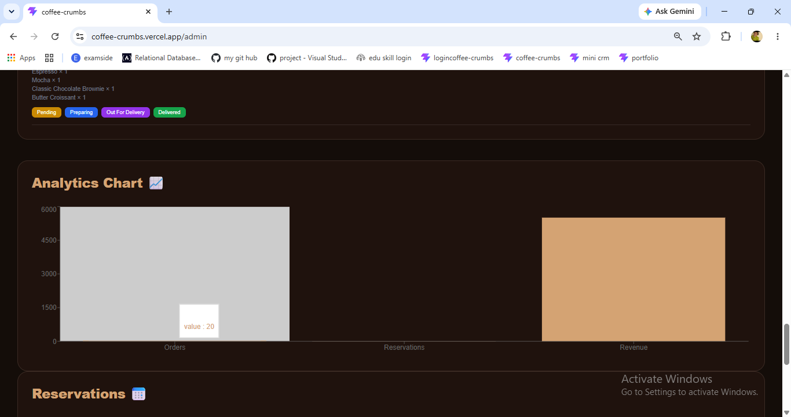

# ☕ Coffee Crumbs

A modern and responsive coffee shop web application built using **React, Vite, Tailwind CSS, and Firebase**. Coffee Crumbs provides customers with a seamless experience to browse the menu, place orders, track orders, leave reviews, and interact with a beautiful coffee-themed interface.

## 🌐 Live Demo

🔗 https://coffee-crumbs.vercel.app

## 📂 GitHub Repository

🔗 https://github.com/black-panther1209/coffee-crumbs

---

## ✨ Features

### 👨‍🍳 Customer Features

* Browse a rich coffee shop menu
* Search menu items instantly
* Category-wise menu filtering
* Add items to cart
* Modify item quantities
* AI-powered food recommendations
* Place orders online
* Track orders using order number
* Submit and view customer reviews
* Responsive design for all devices

### 🔐 Admin Features

* Secure admin login
* Manage customer orders
* Update order status
* Monitor customer reviews
* Dashboard for order management

---

## 🛠️ Tech Stack

### Frontend

* React.js
* Vite
* Tailwind CSS
* React Router DOM
* Framer Motion
* Lucide React

### Backend & Database

* Firebase Firestore
* Firebase Authentication

### Deployment

* GitHub
* Vercel

---

## 📸 Screenshots


### Home Page


### About Section


### Menu Categories


### Menu Items


### Gallery


### Table Reservation


### Contact Form


### Review Submission


### Customer Testimonials


### Admin Login


### Dashboard Overview


### Recent Orders


### Reservations Management


### Analytics Dashboard


---

## 🚀 Installation

Clone the repository

```bash
git clone https://github.com/black-panther1209/coffee-crumbs.git
```

Navigate to project folder

```bash
cd coffee-crumbs
```

Install dependencies

```bash
npm install
```

Create a `.env` file and add Firebase configuration

```env
VITE_FIREBASE_API_KEY=YOUR_API_KEY
VITE_FIREBASE_AUTH_DOMAIN=YOUR_AUTH_DOMAIN
VITE_FIREBASE_PROJECT_ID=YOUR_PROJECT_ID
VITE_FIREBASE_STORAGE_BUCKET=YOUR_STORAGE_BUCKET
VITE_FIREBASE_MESSAGING_SENDER_ID=YOUR_SENDER_ID
VITE_FIREBASE_APP_ID=YOUR_APP_ID
```

Run development server

```bash
npm run dev
```

Build for production

```bash
npm run build
```

---

## 📈 Project Highlights

* Full deployment workflow using GitHub and Vercel
* Firebase Firestore integration
* Authentication-based admin access
* Dynamic order tracking system
* Responsive UI built with Tailwind CSS
* Modern coffee shop themed design

---

## 👨‍💻 Author

**Shristi Pandey**

* GitHub: https://github.com/black-panther1209
* LinkedIn: https://www.linkedin.com/in/shristi-pandey-b689033b1

---

⭐ If you like this project, consider giving it a star on GitHub.
